### 第一讲  认识Excel

像这样直接在单元格里输公式，可以直接计算出来结果。（注意要有等号）

文件-选项-高级，拉到最下面的 Lotus兼容性设置。

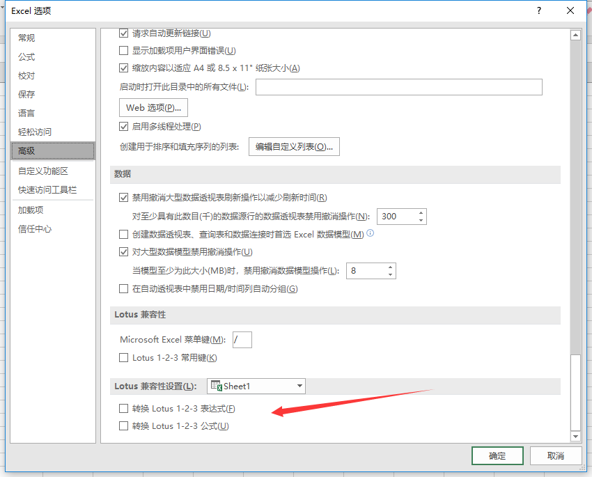

把转换 Lotus1-2-3公式 这个选项勾选上后，就可以在单元格里直接输入类似2+3(不需要等号)这样的公式，它会直接计算出结果。（此选项不建议勾选）

### ----------------------------------------------------------
各个位置的名称：

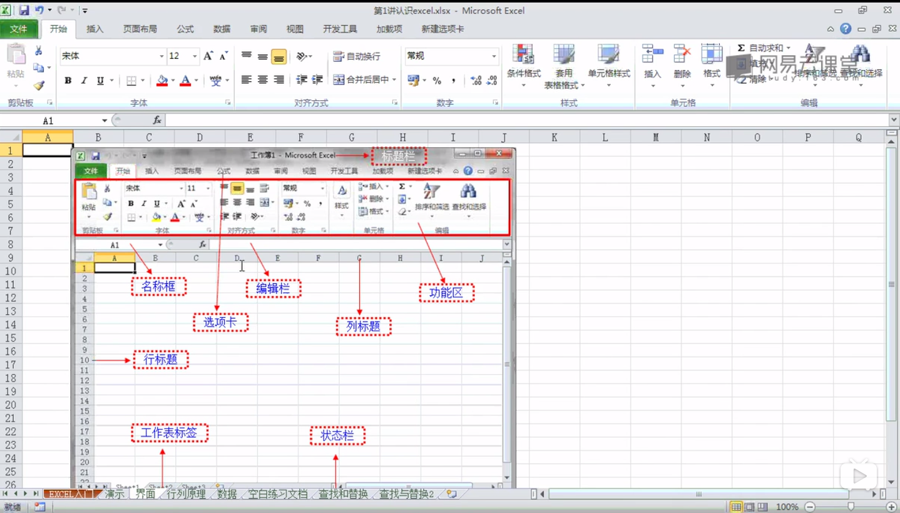

工作区文件（为了保存两个工作表并排的布局的）：
视图-保存工作区
工作区只是保存布局的样式，相当于一个快捷方式，与数据无关。

#### ----------------------------------------------------------------------------
首先，视图-新建窗口，然后再 视图-全部重排

可以同时看到同一个文件中的两个工作表的内容，而且互为镜像（不论改哪个工作表中的内容，另一个也相应改变）。

最后，  视图-保存工作区  ，这样的话，就可以保存布局了。

 
 
 

=============================================

=============================================

新建工作表

更改工作表标签的颜色：

不想要颜色，就改回无颜色。

=============================================

=============================================

选中多个标签：按住shift，同时点多个标签中的开头的那一个和结尾的那一个。

插入多个工作表：选中多个标签以后，点右键，选择工作表，点确定。
删除：同理。

=============================================

**插入行**
--
+ **插入单行**

在第4行前面插入一行，那就在第4行上点右键，选择插入。效果如下：

+ **插入多行**

选择多行，右键插入，就可插入多行。

+ **删除同理，列也同理。**

=============================================

**交换两个列**
--
+ **拉走单元格**

首先，选中单元格

然后，把鼠标移到单元格的边框线上

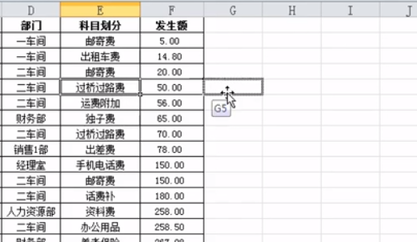
最后，拉动单元格。

+ **交换两个列**

首先，选中C列

鼠标移到选中的列的边框线上

如果直接来到D列上，会提示下图：

此时，如果点了确定，就会替换掉，相当于覆盖了。
要想交换两个列，要按住shift键再拖动。效果如下：

此时，只要把这条虚线放到D列的后面就可以交换两个列了。

=============================================

**调整行高列宽**
--
+ **调整列宽**

选中列，把鼠标移到如图的位置，左右拉即可改变列宽。
如果这时候双击的话，列宽会自动变成可以显示单元格里内容的最窄的样子。

选择多列，然后在任意一列的改变列宽的位置调整，那么这多个列就会同时被调整宽度，都是同样的宽度。

+ **调整行高**

同理。

=============================================

**选择单元格**
--

任意选中一个单元格，把鼠标移到下面的边框线上，双击，就会移动到此列的最下面一格。
同理，在左边框线上双击，会移到最左边。上和右也是一样。
注：是对有内容的单元格的效果，如果是无内容的则无效。

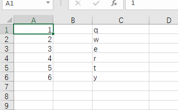
像这种，如果在A1这个单元格这里双击右边框线，那么只会移动到B1。

=============================================

**冻结窗格**
--

视图  ——  冻结窗格

先选中A4单元格，再点击冻结窗格，那么前3行就会被冻结。（原理：会冻结选中单元格的左边和上面的行和列。）

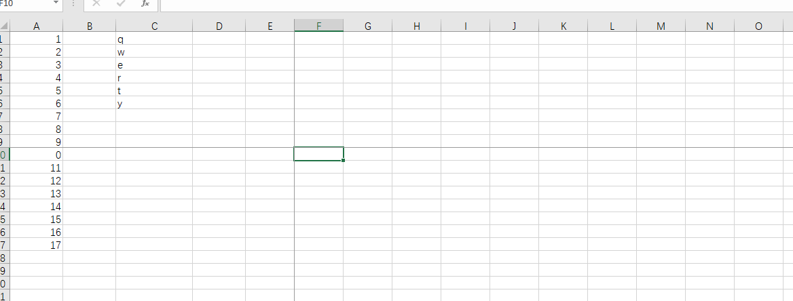
比如像这样。

=============================================

**填充柄**
--

其实就是拖拽。

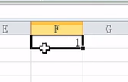
可以看到选中的单元格右下角是个实心的黑色小方块。把鼠标移上去，点左键，按住不放，往任意一个方向拉（只能上下左右四个方向，不能斜向），松开后，其他单元格里都会出现开始选中的单元格中的内容。效果如下：

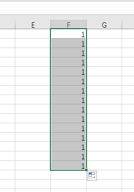

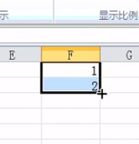
如果选中上图这样，再一拉，就会按顺序自动填充。效果如下：

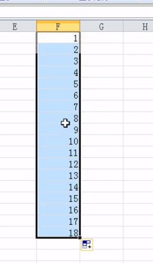

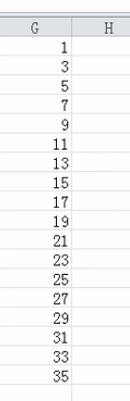
还可以这样（excel会自己找规律）。

**小技巧**：ctrl+冒号键，会在单元格里填上今天的日期。
&emsp;&emsp;&emsp;&emsp;回车：代表输入完了。

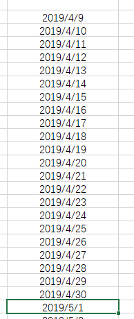
对于日期，选中一个拖拽，它就会一天天排下来。也会自动从4月排到5月。
&emsp;
&emsp;

以下规律：（一个是复制，一个是顺序填充，ctrl键是切换它们两个的开关）
如果**数字**想只选中一个单元格拖拽，就按顺序填充的话，就需要按住**ctrl**键，再用左键拖拽。
而**日期**想要只选中一个单元格拖拽，就复制的话，就按住**ctrl**键，再用左键拖拽。

**自定义序列**
自定义想拖拽的内容，比如张三，可以拖拽出李四、王五等。
文件——选项——高级，拉到最下面，有个 编辑自定义列表。

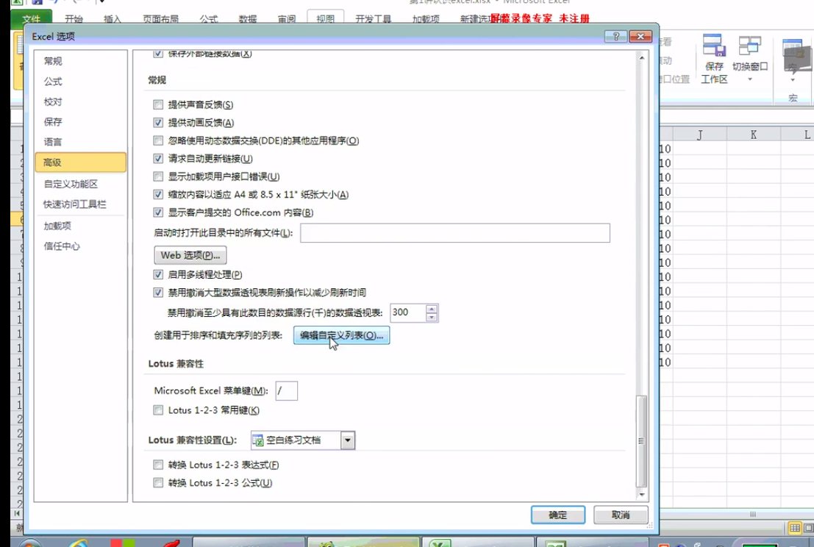

然后，

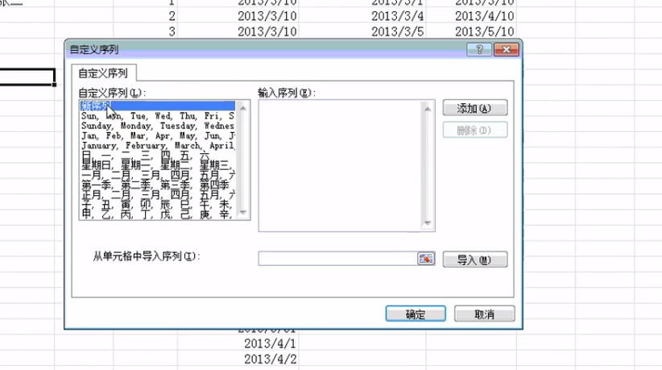

先在左侧点一下 新序列，然后在右侧开始输入，输入完一个，回车，继续输入下一个。写好后，点击添加按钮即可。

=============================================

**选中第2行到第100行**
--

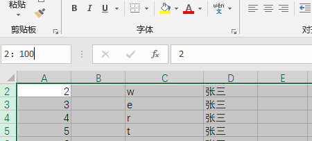

在名称框里这样打即可。